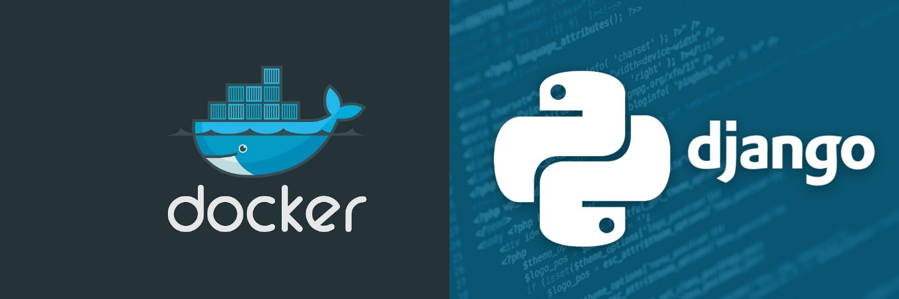
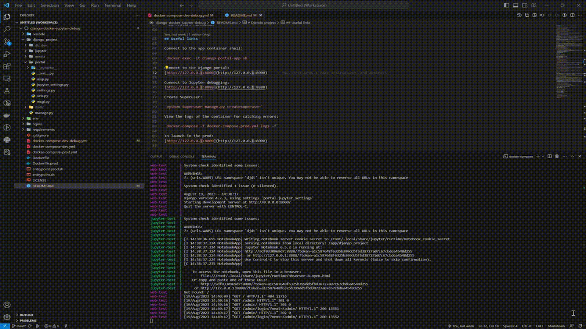

# Djando project
This repository complete to work with django, jupyter and debugging work in container docker.

## Development: 
Includes a container with a functioning Django server and a Postgresql database server.

`docker-compose -f docker-compose-dev.yml build`

`docker-compose -f docker-compose-dev.yml up`

## Development with manual debugging or using VS Code:
Includes a container with Django north, PosgreSQL database, Jupyter server.

`docker-compose -f docker-compose-dev-debug.yml build`

`docker-compose -f docker-compose-dev-debug.yml up`

## Production:
Includes a Gunicorn server container, a Postgresql database and a server for reverse proxying Nginx.

`docker-compose -f docker-compose-prod.yml build`

`docker-compose -f docker-compose-prod-debug.yml up`

## Explanation:
I tried to avoid problems during the build process, however, this is not excluded, problems may arise if different versions of containers (prod, dev) are mounted on the same machine. There may also be problems due to the non-synchronous start of containers, I have provided for waiting for containers before starting, you can change this parameter (sleep 5s).

The configuration parameters are placed in the [.env](env/.env) and [db.env](env/db.env) files.

Python dependencies are placed in a file [comment.txt](requirements/comment.txt) [development.txt](requirements/development.txt) and [production.txt](requirements/production.txt) .

If additional commands are needed when building the image, use the file [entrypoint.sh](entrypoint.sh) and [entrypoint.prod.sh](entrypoint.prod.sh) . These bash commands are executed at the time of image creation (build).

## Python debugging (in VS Code shell):
1. Option 1

Remotely connect to the container and request debugging in the container/

2. Option 2

Use the configuration for remote python connection "Jango Portal Python Debug" [launch.json](.vscode/launch.json)
Before doing this, you need to start the containers (`docker-compose-dev-debug.yml`).
The difference is that extra containers have been cut in this container, only the functionality necessary for debugging.

Useful [link](https://code.visualstudio.com/docs/datascience/jupyter-notebooks#_connect-to-a-remote-jupyter-server
) for jupyter debug in VS Code.

## Jupyter debugging (in VS Code shell):
1. Start the container for debugging, wait for migrations to be performed. It is absolutely necessary to run in debug mode (Python) the steps above and then a window will appear with a message about starting the server. 

`docker-compose -f docker-compose-dev-debug.yml build`

`docker-compose -f docker-compose-dev-debug.yml up`

- if a token is used copy the URL of the jupyter server example: 

`http://127.0.0.1:8888/?token=9795db6df98f4246a7b353d262f6acdac7b4bff00e67d57d`

- go to the required jupyter notebook file
- select the kernel kernel - ("Existing Jupyter Server")
- specify the copied address previously
- set the configuration name
- to restart execution

## Using Browser

## Using VS Code

## Useful links

Connect to the app container shell:

`docker exec -it django-portal-app sh`

Connect to the Django portal:
[http://127.0.0.1:8000](http://127.0.0.1:8000)

Connect to Jupyter debugging:
[http://127.0.0.1:8888](http://127.0.0.1:8888)

Create Superuser:

`python Superuser manage.py createsuperuser`

View the logs of the container for catching errors:

`docker-compose -f docker-compose.prod.yml logs -f`

To launch in the prod:
[http://127.0.0.1:8000](http://127.0.0.1:8000)

# RUS
## Разработка: 

Разработка: включает контейнер с функционирующим сервером Django и сервером быза данных PostgesQL.

`docker-compose -f docker-compose-dev.yml build`

`docker-compose -f docker-compose-dev.yml up`

## Разработка с отладкой в ручном режими или с испольщованием VS Code:
Разработка с отладкой в ручном режими или с испольщованием VS Code: включает контейер с севером Django, базой данных PosgresQL, сервером Jupyter.

`docker-compose -f docker-compose-dev-debug.yml build`

`docker-compose -f docker-compose-dev-debug.yml up`

## Производтсво:
Производство: включает контейнер сервер Gunicorn, базой данных PosgresQL и сервер для обратного проксирвоания Nginx.

`docker-compose -f docker-compose-prod.yml build`

`docker-compose -f docker-compose-prod-debug.yml up`

## Пояснение:
Я постарался что бы в процессе сборки не возникало проблем однако это не исключено, проблемы могут возникнуть если на одной машине будут смонитрованы разные версии контейнеров (prod, dev). Также проблемы могут быть из-за не синхронного запуска контейнеров, я предусмотерл ожидение контейнеров предд запуском, вы может изменит этот параметр (sleep 5s).

Параметры конфигурации вынесены в файл [.env](env/.env) и [db.env](env/db.env).
Зависимости python вынесены в файл [comment.txt](requirements/comment.txt) [development.txt](requirements/development.txt) и [production.txt](requirements/production.txt) .

(RUS) Если необходимы дополнительные команды при сборке образа, используйте файл  [entrypoint.sh](entrypoint.sh) и [entrypoint.prod.sh](entrypoint.prod.sh). Эти баш команды выаолянют в момент создания образа (build).

## Отладка Python (в оболочке VS Code):
1. Вариант 1
Удалённо подлючиться  к контейнеру и запутсить отладку в контейнере, однако это не практично
2. Вариант 2.

Использовать конфигурацию для удалённого подключения python "Jango Portal Python Debug" (.vscode/launch.json)
Перед этим необходимо запустить контейнеры (`docker-compose-dev.debug.yml`).
Отличие в том, что в этом контейнере урезаны лишние контейнеры,  только необходимый для отладки функционал.

[Ссылка](https://code.visualstudio.com/docs/datascience/jupyter-notebooks#_connect-to-a-remote-jupyter-server
) на исходную документацию.
## Отладка Jupyter (в оболочке VS Code):
1. Запустить контейнер для отладки, дождаться выполнения миграций. Обязательно необходимо выполнить запуск в режиме отладки (Python) шаги выше и тогда появится окно с собщение о запуске сервера. 

`docker-compose -f docker-compose-dev.debug.yml build`

`docker-compose -f docker-compose-dev.debug.yml up`

- если используется токен скопировать URL адрес сервера jupyter
- пример:

`http://127.0.0.1:8888/?token=9795db6df98f4246a7b353d262f6acdac7b4bff00e67d57d`

- перейти в требуемый испольняемый файл jupyter notebook
- выбрать ядро kernel - ("Existing Jupyter Server")
- указать скопированный адресс ранее
- задать имя конфигурации
- зпустить выполнение

## Используя браузер

## Используя VS Code

## Полезные ссылки

Подключиться к оболчке контейнера app:

`docker exec -it django-portal-app sh`

Подключиться к порталу Django:
[http://127.0.0.1:8000](http://127.0.0.1:8000)

Поддключиться к отладке Jupyter:
[http://127.0.0.1:8888](http://127.0.0.1:8888)

Создать супераользователя:

`python Superuser manage.py createsuperuser`

Посмотреть логи контейнера для отлова ошибок:

`docker-compose -f docker-compose.prod.yml logs -f`

Для запуска в проде
[http://127.0.0.1:8000](http://127.0.0.1:8000)